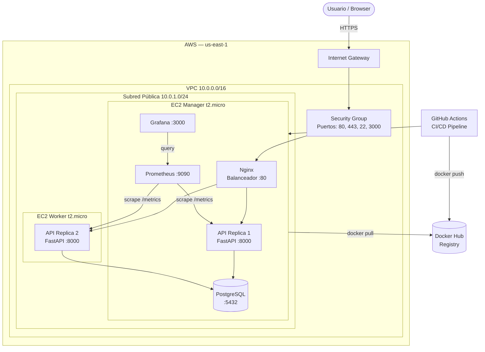
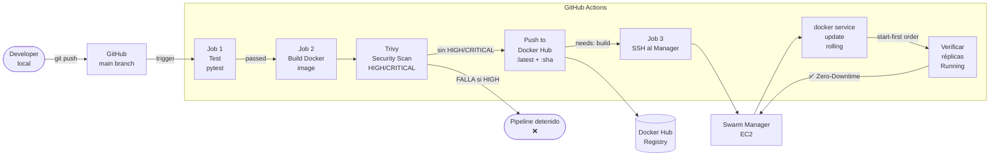
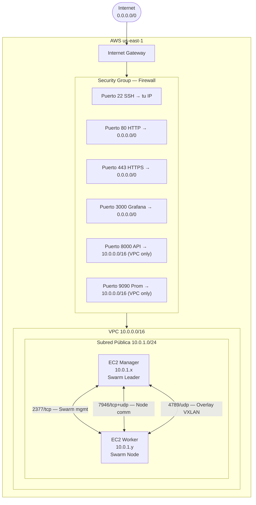
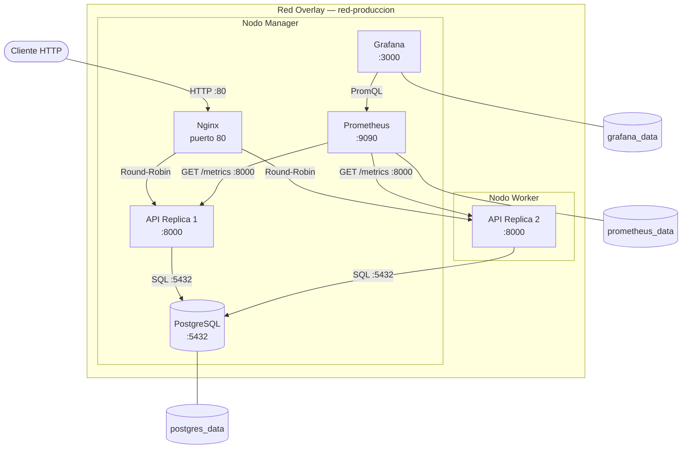

# Sistema de Inventario de Equipos TI

[](https://github.com/Antonio-Sj04/ProyectoSistemas/actions/workflows/deploy.yml)
[](https://python.org)
[](https://fastapi.tiangolo.com)
[](https://docs.docker.com/engine/swarm/)
[](https://postgresql.org)

> **Proyecto Final — Sistemas Operativos II**  
> Simulación de migración empresarial a la nube con infraestructura DevOps completa.  
> **Autor:** Antonio Samayoa

---

## Descripción

API REST construida con **FastAPI + PostgreSQL** para gestionar el inventario de equipos tecnológicos de una empresa. Desplegada en **AWS** usando **Docker Swarm** con orquestación de contenedores, pipeline **CI/CD automatizado** con GitHub Actions, escaneo de seguridad con **Trivy** (DevSecOps), e infraestructura como código con **Terraform**.

### Funcionalidades
- CRUD completo de **Departamentos**, **Equipos** y **Asignaciones**
- **Trigger SQL de auditoría** automático en PostgreSQL
- Historial de cambios de estado por equipo
- Monitoreo con **Prometheus + Grafana**
- Documentación interactiva en **Swagger UI**

---

## Arquitectura

### Diagrama 1 — Arquitectura Cloud AWS



### Diagrama 2 — Pipeline CI/CD



### Diagrama 3 — Diagrama de Red



### Diagrama 4 — Servicios Docker Swarm



---

## Requisitos Previos

| Herramienta | Versión | Uso |
|-------------|---------|-----|
| Python | 3.11+ | Runtime de la API |
| Docker Desktop | 4.x+ | Contenedores locales |
| Terraform | 1.5+ | Infraestructura AWS (instancias t3.micro) |
| AWS CLI | 2.x | Configurar credenciales |
| Git | 2.x | Control de versiones |

---

## Levantar en Local (Desarrollo)

### 1. Clonar el repositorio

```bash
git clone https://github.com/Antonio-Sj04/ProyectoSistemas.git
cd ProyectoSistemas
```

### 2. Configurar variables de entorno

```bash
# Copiar el archivo de ejemplo
cp .env.example .env

# Editar con tus valores (en Windows: notepad .env)
# El archivo .env NUNCA se sube a Git
```

### 3. Levantar con Docker Compose

```bash
# Construir imágenes y levantar todos los servicios
docker-compose up --build

# O en segundo plano
docker-compose up --build -d

# Ver logs de la API
docker-compose logs -f api
```

### 4. Probar la API

- **Swagger UI (documentación interactiva):** http://localhost:8000/docs
- **ReDoc:** http://localhost:8000/redoc
- **Health check:** http://localhost:8000/health
- **Métricas Prometheus:** http://localhost:8000/metrics

### 5. Conectar DBeaver a PostgreSQL local

```
Host: localhost
Puerto: 5432
Base de datos: inventario_ti
Usuario: usuario
Contraseña: password
```

### 6. Detener servicios

```bash
docker-compose down

# Eliminar también los volúmenes (borra datos de la BD)
docker-compose down -v
```

---

## Deploy en AWS con Terraform

### 1. Configurar credenciales AWS

```bash
aws configure
# AWS Access Key ID: TU_ACCESS_KEY
# AWS Secret Access Key: TU_SECRET_KEY
# Default region: us-east-1
# Default output format: json
```

### 2. Crear Key Pair en AWS

Ir a **AWS Console → EC2 → Key Pairs → Create key pair**
- Nombre: `clave-inventario`
- Tipo: RSA
- Formato: `.pem`
- Guardar el archivo `.pem` en el directorio del proyecto (está en `.gitignore`)

### 3. Inicializar y aplicar Terraform

```bash
cd terraform

# Descargar proveedores de Terraform
terraform init

# Previsualizar los recursos a crear
terraform plan

# Crear la infraestructura (confirmar con "yes")
terraform apply

# Copiar las IPs del output:
# ip_publica_manager = "X.X.X.X"
# ip_publica_worker = "Y.Y.Y.Y"
```

### 4. Inicializar Docker Swarm

```bash
# Conectarse al Manager
ssh -i clave-inventario.pem ec2-user@IP_MANAGER

# En el Manager — inicializar Swarm
docker swarm init --advertise-addr IP_PRIVADA_MANAGER

# Copiar el comando "docker swarm join --token ..." que aparece

# En otra terminal — conectarse al Worker
ssh -i clave-inventario.pem ec2-user@IP_WORKER

# En el Worker — unirse al Swarm (pegar el comando copiado)
docker swarm join --token SWARMTOKEN IP_PRIVADA_MANAGER:2377

# Verificar en el Manager
docker node ls
```

### 5. Deploy del Stack de Producción

```bash
# En el Manager — copiar archivos del proyecto
scp -i clave-inventario.pem -r monitoring/ ec2-user@IP_MANAGER:~/
scp -i clave-inventario.pem production-stack.yml ec2-user@IP_MANAGER:~/
scp -i clave-inventario.pem sql/schema.sql ec2-user@IP_MANAGER:~/

# Crear el secret de la base de datos
echo "postgresql://inventario:MiPasswordSeguro@db:5432/inventario_ti" | \
  docker secret create db_url -

# Deploy del stack completo
export DOCKER_HUB_USER=tu_usuario_docker_hub
docker stack deploy -c production-stack.yml inventario

# Verificar servicios
docker service ls
docker service ps inventario_api
```

---

## Configurar CI/CD — GitHub Secrets

En tu repositorio GitHub: **Settings → Secrets and variables → Actions → New repository secret**

| Secret | Valor |
|--------|-------|
| `DOCKER_USERNAME` | Tu usuario de Docker Hub |
| `DOCKER_TOKEN` | Token generado en Docker Hub → Account Settings → Security |
| `EC2_HOST` | IP pública del Manager (output de Terraform) |
| `EC2_USER` | `ec2-user` |
| `EC2_SSH_KEY` | Contenido completo del archivo `.pem` (incluyendo las líneas `-----BEGIN...`) |

Después de configurar los secrets, cualquier push a `main` dispara automáticamente el pipeline.

---

## Variables de Entorno

| Variable | Descripción | Ejemplo |
|----------|-------------|---------|
| `DATABASE_URL` | Cadena de conexión PostgreSQL | `postgresql://user:pass@db:5432/inventario_ti` |
| `POSTGRES_USER` | Usuario de la BD | `inventario` |
| `POSTGRES_PASSWORD` | Contraseña de la BD | `MiPasswordSeguro` |
| `POSTGRES_DB` | Nombre de la base de datos | `inventario_ti` |
| `SECRET_KEY` | Clave para tokens JWT | Cadena aleatoria larga |
| `DOCKER_HUB_USER` | Usuario Docker Hub para el stack | `miusuario` |

---

## Estructura del Proyecto

```
ProyectoSistemas/
├── app/                    # Código fuente de la API
│   ├── main.py             # Punto de entrada FastAPI
│   ├── config.py           # Configuración con pydantic-settings
│   ├── database.py         # Conexión SQLAlchemy
│   ├── models.py           # Modelos ORM
│   ├── schemas.py          # Schemas Pydantic
│   └── routers/            # Endpoints CRUD
│       ├── departamentos.py
│       ├── equipos.py
│       └── asignaciones.py
├── sql/
│   └── schema.sql          # DDL + Trigger + Datos dummy
├── terraform/
│   └── main.tf             # Infraestructura AWS completa
├── monitoring/
│   ├── prometheus.yml      # Config de scraping
│   └── grafana/
│       └── datasource.yml  # Datasource auto-provisionado
├── .github/workflows/
│   └── deploy.yml          # Pipeline CI/CD con Trivy
├── Dockerfile              # Multi-stage build
├── docker-compose.yml      # Entorno de desarrollo local
├── production-stack.yml    # Stack Docker Swarm producción
├── requirements.txt        # Dependencias Python
└── .env.example            # Plantilla de variables de entorno
```

---

## Endpoints de la API

| Método | Endpoint | Descripción |
|--------|----------|-------------|
| GET | `/` | Bienvenida |
| GET | `/health` | Health check |
| GET | `/metrics` | Métricas Prometheus |
| GET | `/docs` | Swagger UI |
| GET/POST | `/departamentos/` | CRUD Departamentos |
| GET/PUT/DELETE | `/departamentos/{id}` | Departamento por ID |
| GET/POST | `/equipos/` | CRUD Equipos |
| GET/PUT/DELETE | `/equipos/{id}` | Equipo por ID |
| GET | `/equipos/{id}/historial` | Auditoría de cambios de estado |
| GET/POST | `/asignaciones/` | CRUD Asignaciones |
| GET/PUT/DELETE | `/asignaciones/{id}` | Asignación por ID |

---

## Trigger SQL de Auditoría

El trigger `audit_cambio_estado` se dispara automáticamente **BEFORE UPDATE** en la tabla `equipos` cuando cambia el campo `estado`. Inserta un registro en `historial_equipos` con:
- Estado anterior y nuevo
- Timestamp exacto del cambio
- Usuario de base de datos que ejecutó el cambio

Para verificarlo en DBeaver o psql:
```sql
-- Cambiar estado de un equipo
UPDATE equipos SET estado = 'mantenimiento' WHERE id = 1;

-- Ver el registro de auditoría generado automáticamente
SELECT * FROM historial_equipos WHERE equipo_id = 1;
```

---

## Monitoreo

| Servicio | URL | Credenciales |
|----------|-----|--------------|
| Grafana | `http://IP_MANAGER:3000` | admin / admin123 |
| Prometheus | `http://IP_MANAGER:9090` | Sin autenticación |
| API Metrics | `http://IP_MANAGER/metrics` | Sin autenticación |
# Pipeline test 05/29/2026 22:36:01

